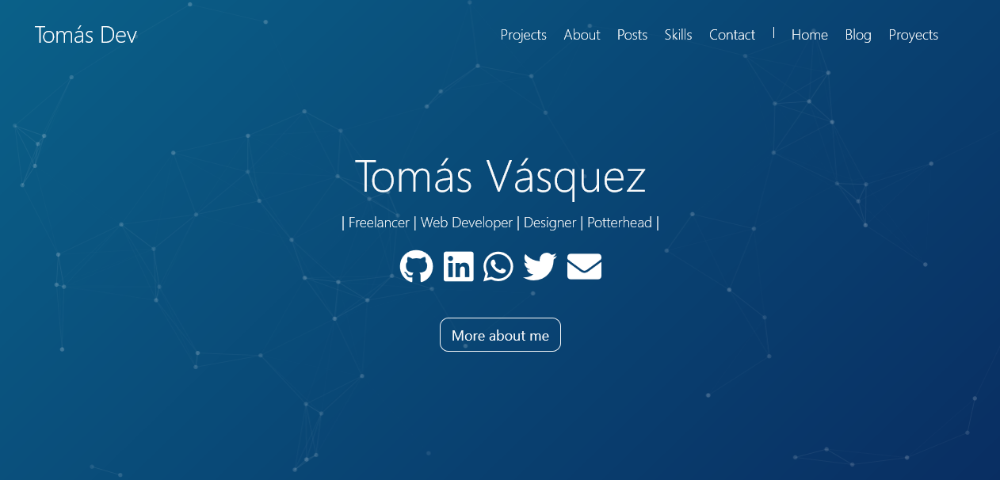

# Open Portafolio

portafolio de proyectos para desarrolladores.



## Demo

Mira este proyecto aqui: https://tomas-dev.vercel.app

## Caracteristicas

- Puntaje de 100% en a11y / Performance / PWA / SEO
- PWA (escritorio y móvil)
- Fácil de personalizar
- Tablet & mobile friendly
- Despliege continuo en vercel
- Muestra tus proyectos con mas estrellas de github 
- estilos en sass
- Widget simple para wathsapp
- Fondo animado
- Blog personal usando archivos markdown

## Estructura

```bash
.
├── data
│   └── config              # SEO related tags
├── src
│   └── assets              # Assets
│   │   │── icons             # icons
│   │   │── illustrations     # illustrations from (undraw.co)
│   │   └── thumbnail         # cover of your website when it's shared to social media
│   ├── components          # Components
│   │   │── common            # Common components
│   │   │── landing           # Components used on the landing page
│   │   └── theme             # Header & Footer
│   └── pages               # Pages
└── static                  # favicon & Netlify redirects
```

## Variables de entorno

```
GITHUB_LOGIN => tu nombre de cuenta de github
GITHUB_PERSONAL_ACCESS_TOKEN => tu token de acceso de github
```

## Licensia

Este proyecto está licensiado bajo la licensia MIT  - mira el archivo [LICENSE.md](LICENSE.md) para más detalles

## Soporte

Puedes consultarme cualquier cosa sobre este proyecto atravéz de cualquiera de mis redes sociales que aparecen en mi página personal:

https://tomas-dev.vercel.app

  