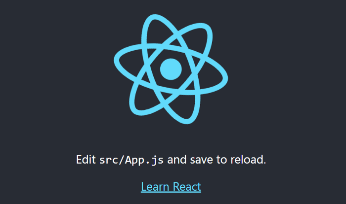

React es la biblioteca más popular en uso en la actualidad, muchas de las grandes empresas están usando React. También ha vuelto con la gran empresa Facebook, esta es también la razón por la popularidad. Comenzar con cualquier idioma es difícil, requiere tiempo para comprender bien el concepto. Para entender bien el concepto, debemos dar pequeños pasos al principio y luego podemos aumentar nuestra velocidad de aprendizaje.

### **¿Qué es React.js?**

React es una **biblioteca de capas de vista** , no un marco como **Backbone** , **Angular** , etc. Sin rutas, sin controlador, solo interfaz de usuario. No puede usar React para crear una aplicación web completamente funcional. React es **V** en **MVC,** por lo que podemos usar react como capa de vista en Angular **.** React es una biblioteca JS declarativa, eficiente, basada en componentes y flexible. Todos los componentes se crean con React usando JS, no un lenguaje de plantilla especial. (Como html, jade, hbs). Cada elemento creado usando solo JS.

**Que tiene de bueno usar React js?**

- Fácil de entender. Puede manejar actualizaciones complejas y aún sentirse rápido y receptivo.
- React se basa en componentes significa que podemos dividir los componentes en componentes más pequeños.
- Utiliza todo el poder de JS JavaScript para mostrar vistas.
- Ningún flujo de datos bidireccional complejo React es un flujo de datos unidireccional de padre a hijo.
- Más fácil de entender que el enlace bidireccional.
- Utiliza menos código.
- **¡react es rápido!**

El DOM real es lento pero JavaScript es rápido. Usar DOM virtual significa que la interfaz de usuario solo se actualiza cuando realmente cambia. La extensión React Chrome hace que la depuración sea mucho más fácil.

**que tiene de malo usar React js?**

Sí, hay algunas desventajas al usar React.

- React no es más que la vista. Sin eventos, sin XHR, sin datos / modelos, sin promesas / diferidos.
- La construcción de JSX requiere un trabajo adicional que no es realmente engañoso (simplemente considero JSX como HTML). Pero la mayor parte del trabajo ya está hecho por **react-tools.**
- No es compatible con navegadores más antiguos.
- React no funcionará con IE8.

### **Instalación de React**

React JS es solo una biblioteca de JavaScript, por lo que simplemente podemos agregar el siguiente enlace CDN en nuestro proyecto dentro de la etiqueta de script.

```html
<script crossorigin src = ”https://unpkg.com/react@16/umd/react.development.js"> </script><script crossorigin src = ”https://unpkg.com/react-dom@16/umd/react-dom.development.js"> </script>
```

O bien, la mejor manera y la forma recomendada es instalar usando NPM. (Asegúrese de que hayamos instalado [Node.js](https://nodejs.org/en/download/) en nuestro sistema).

Instalamos el paquete de nodo **create-react-app** que ayuda a configurar un proyecto React. **create-react-app es una herramienta desarrollada por Facebook que nos brinda la aplicación de reacción de inicio masivo. Nos ahorra tiempo de instalación y configuración.**

Instale el paquete de nodo create-react-app de forma global con el siguiente comando.

```shell
npm install -g create-react-app
```

Para crear un proyecto de reacción, use el siguiente comando

```shell
Crear-react-aplicación hello-world
```

El comando anterior crea una carpeta con el nombre **hello-world** que es proyectar nuestra carpeta que contiene la configuración básica del proyecto y para probar que todo funciona correctamente, navegamos dentro de la carpeta y presionamos el comando npm start.

```powershell
Cd hello-world
npm start
```

Una vez que presione npm start, se abrirá el navegador **Chrome** con URL: **localHost: 3000** . Si no, puede presionar esta URL una vez que vea **compilado correctamente.** en terminal.


Comprender la estructura de carpetas

Saltaré otra carpeta y me concentraré en la carpeta **src** . En este encontrará el archivo **index.js** , es un archivo javascript correspondiente al archivo index.html. Este archivo contiene la siguiente línea de código.

```
ReactDOM.render (<App />, document.getElementById ('root'))
```

La línea anterior requiere dos parámetros 1) Elemento / Componente 2) dónde renderizar. Entonces le dice que cargue el componente de la aplicación en un elemento HTML con id root. Este es el elemento Div presente en el elemento index.html.

Otra importante archivo en la carpeta src es **app.js** . Este es el archivo del componente de la **aplicación** . **App** Component es el componente principal en React que actúa como un contenedor para todos los demás componentes. podemos cambiarle el nombre si queremos y luego agregar el nombre del componente en el archivo index.js.

### **¿Qué es JSX o qué es JSX?**

Es una extensión de sintaxis para código JavaScript que se parece mucho a **HTML** , tiene todo el poder de JavaScript. Vea el fragmento de abajo.

```jsx
render () {
    return (
       <div> Hola </div> // JSX
     )
}
```

Lo que escribimos dentro de la función de retorno se considera JSX. si observa, no era más que código HTML. Una cosa importante es que la declaración de retorno puede devolver solo un elemento, por lo que si queremos devolver varios elementos, asegúrese de envolverlos dentro de un elemento div principal. debajo del código JSX no es válido.

```jsx
render () {
    return (
       <div> Hola </div>
       <div> Mundo </div>
     )
}
//esto arrojará un error en el navegador
```

### **¿Qué es un Componente React?**

React Component es una clase o función de JavaScript. Que acepta entradas y devuelve un elemento que vemos en la interfaz de usuario. No ingresa nada más que propiedades (accesorios). Una aplicación no es más que una colección de varios componentes, y su componente puede tener su componente hijo. que se comunicarán entre sí.

Creemos el componente ahora:

En React podemos crear componentes de dos formas.

1. Componente StateFul: se escriben utilizando clases ES6 en lugar de funciones.

```jsx
importar React, {Componente} de 'react';
La aplicación de clase amplía el componente {
   Render () {
      returns (
        <div> Hello </div>
      )
   }
}
exporta la aplicación predeterminada
```

\2. Componente funcional o sin estado: se escriben mediante la función de flecha.

```jsx
importar React, {Componente} de 'react';
Const App = () => <div> Hola </div>
exportar la aplicación predeterminadaOimportar React, {Componente} de 'react';
Const App = () =>
    render () {
      return (
         <div> Hola </div>
      )
}
exportar aplicación predeterminada
```

Una nota importante: el componente tiene solo un método de renderizado y retorno que muestra algo en la pantalla.

### **Que son los Props?**

Los componentes le permite dividir su interfaz de usuario en múltiples piezas reutilizables y pensar en cada pieza de forma aislada. Entonces, cuando dividimos un componente en varios componentes, necesitamos pasar los datos de padre a hijo. **Props (propiedades)** se usa para transmitir datos desde el componente principal y se accede a través de **this.props en child.** vea el fragmento de abajo.

En el archivo index.js, estoy agregando dos parámetros en la etiqueta de la aplicación. nombre de la ciudad y el país.

```jsx
// index.js ReactDOM.render (<App city = "Mumbai" country = "India" />, document.getElementById ('root'));
```

En el componente App.js, obtengo esas propiedades de la siguiente manera. Aquí estoy obteniendo ciudad y contador en **this.props.**

```jsx
return (
  <div className="App">
    <h1> nombre de la ciudad: - {this.props.city} </h1>
    <hr> </hr>
    <h1> Nombre del país: - {this.props.country} </h1>
  </div>
);
```


this.props.city y this.props.country accediendo en el componente de la aplicación

### **Que son los estados de de un componente?**

El estado no es más que un contenedor que almacena datos y solo se puede definir en el componente basado en clase que significa componente con **estado** . no podemos usar el estado en el componente funcional. Indique este **usuario definido** y **debe ser objetos JavaScript simples** . Vea el ejemplo a continuación.

```javascript
state = {
  html: "HTML5",
  javascript: "javaScript",
  mecanografiado: "ES6 Basic",
  nodo: "NPM",
  contentChangeText: "Verá que este contenido cambiará en 3 segundos",
};
```

Podemos acceder al estado en el componente usando **this.state.propertyName** .

Siempre que los cambios de datos de estado reaccionen, vuelva a renderizar el DOM y actualice solo el componente que realmente cambia. y para actualizar el estado (objeto JavaScript) necesitamos llamar al método setState ({}) que es proporcionado solo por react.

```javascript
this.setState({
  contentChangeText:
    "Ahha Cambio de contenido usando el método this.setState ({})",
});
```

Arriba puede ver que estoy cambiando el valor de **contentChangeText en el método setState ({})** . Vea el código a continuación que contiene el ejemplo de accesorios y estado.

```jsx
class App extends Componente {
  state = {
    html: "HTML5",
    javascript: "javaScript",
    typescript: "ES6 Basic",
    node: "NPM",
    contentChangeText: "Verá que este contenido cambiará en 3 segundos",
  };

  render() {
    setTimeout(() => {
      this.setState({
        contentChangeText:
          "ha cambiado de contenido usando this.setState ({}) método",
      });
    }, 3000);

    return (
      <div>
        <h1>
          Obtenemos datos del componente principal en el secundario en
          this.props como se muestra a continuación{" "}
        </h1>
        <h3> nombre de la ciudad: - {this.props.city} </h3> <code>
          {" "}
          this.props.city{" "}
        </code>
        <hr> </hr>
        <h1> Como describe, el estado no es más que un objeto javaScript. </h1>
        <h2>
          A continuación se muestran las cosas que debe aprender antes de react:{" "}
        </h2>
        <ul>
          <li> {this.state.html} </li>
          <li> {this.state.javascript} </li>
          <li> {this.state.typescript} </li>
          <li> {this.state.node} </li>
          <li className="App-change"> {this.state.contentChangeText} </li>
        </ul>
      </div>
    );
  }
}
```


La imagen explica los accesorios y el estado.


Imagen con método setState

Puede encontrar el proyecto hello-world en el siguiente enlace. Contiene uso básico de utilería y estado.
