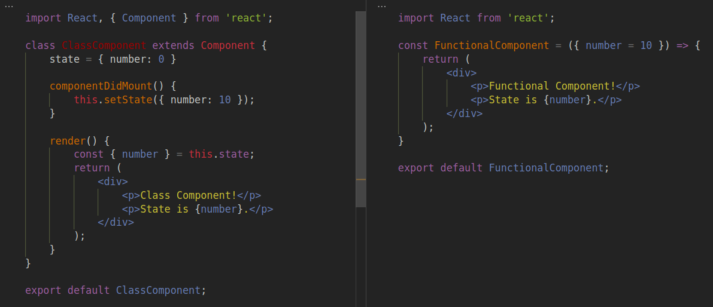

En React, **los componentes de tipo Clase **tienen un estado **inteligente** adjuntado a él y se mantiene persistente a través de las renderizaciones. Entonces los **componentes funcionales** eran **componentes** **sin estado y tontos** , sin estado ni lógica adjunta a ellos.

Como ejemplo, el componente de clase puede tener `state` y podría manipularse utilizando los métodos del ciclo de vida de los componentes, como `constructor`, `componentDidMount`, etc. Sin embargo un componente funcional solo acepta `props`de su padre y se procesa en consecuencia. No mantendria un `state`, o valor interno , que sería persistente a través de los renders, sino más bien los renders de acuerdo con lo que pasó `props`.

En la aplicación compleja de React, hay *un componente de clase* padre que realiza un seguimiento del estado y lo manipula de acuerdo con la lógica empresarial. Posteriormente, los *componentes funcionales* secundarios reciben los datos atravez de props y se utilizan solo con fines de representación. Estos no tendrían ningún estado persistente y solo se usarían para dividir componentes complejos en segmentos.

Los hooks de React permiten **que los componentes funcionales** adjunten **el estado local con él, y React preservará este estado entre re-renderizaciones** . Por lo tanto, esto permitirá que React se use sin clases.

Como se indica, reducirá el uso de componentes de clase complejos con toda la lógica en él. Más bien, parte de esta lógica empresarial se pasará a su componente funcional hijo. Estos componentes funcionales refactorizados tendrán su funcionalidad adjunta, por lo que actuarían como pequeños componentes reutilizables.

**Comencemos con los hooks:** ( **tenga en** cuenta que los hooks no funcionan dentro de las clases).

# State hook

```
import React, { useState } from 'react';
function Example() {
  const [count, setCount] = useState(0);
return (
    <div>
      <p>You clicked {count} times</p>
      <button onClick={() => setCount(count + 1)}> Add </button>
      <button onClick={() => setCount(count - 1)}> Remove </button>
    </div>
  );
}
```

Indique el hook aquí, solo introduzca `**this.State**`y `**this.setState**`a los componentes funcionales. Este `useState`devuelve valor, su descriptor de acceso y se inicia al comienzo: `**const [state, setState] = useState(initialState)**;`. Por lo tanto, en retrospectiva, en contraste con los componentes de clase por `Constructor`, y funciones manipuladas de estado como *handleIncrease* que estaba *vinculado* al `this`alcance.

Además, el enlace de estado se puede iniciar para muchos tipos:

```
const [num, setNum] = useState (10); 
const [nombre, setName] = useState ('predeterminado'); 
const [obj, setObj] = useState ([{texto: 'esto es un objeto'}]);
```

# hook de efecto

El hook de efecto aquí, se utiliza para realizar efectos secundarios en componentes funcionales. De los casos conocidos por el usuario, se podría considerar la combinación de métodos: `**componentDidMount**`, `**componentDidUpdate**`, y `**componentWillUnmount**`. Entonces, cuando React procesa (actualiza el DOM incluido el primer procesamiento), este hook se aplica. Los casos de uso típicos de los hooks de efectos son la obtención de datos, la gestión de suscripciones y el manejo de cambios DOM manuales.

## hook de efecto sin limpieza

Aquí, en cada momento en que este componente funcional se procese (incluido el primer procesamiento y los posteriores `count`cambios debido al cambio) ejecutará la función de hook de efecto. En este caso, realizará el efecto secundario del cambio DOM manual manipulando el elemento externo.

```
importar React, {useState, useEffect } de 'reaccionar';función App () { 
  const [count, setCount] = useState (0);  useEffect (() => { 
     document.title = `Hiciste clic en $ {count} veces`; 
  });return ( 
    <div> 
      <p> Hiciste clic {count} veces </p> 
      <button onClick = {() => setCount (count + 1)}> Click </button> 
    </div> 
  ); 
}
```

## Ejecución condicional de efecto hook

Este hook de efecto actúa para **cada renderizado,** por lo que puede reemplazar métodos de ciclo de vida como `**componentDidMount**`& `**componentDidUpdate**`. Entonces, en el ejemplo anterior, la función de hook se ejecutará en el **montaje del componente (primer renderizado) así como en la actualización del componente (re-renderizado)** , y es posible que no sea necesario ejecutarlo cada vez. Por lo tanto, la ejecución del hook de efectos se puede restringir y decidir mediante un **segundo parámetro que se** pasa a **useFffect** .

```
useEffect (() => { 
  document.title = `Hiciste clic en $ {count} veces`; 
}, [count] );
```

En el hook anterior, se ejecutará en el primer renderizado y siempre que haya un cambio en `count`as. dado por el segundo parámetro como `[count]`. Aquí el hook solo es útil siempre que haya un cambio en ese valor de estado. Además, si `**[]**`se proporciona como parámetro, solo se ejecutará como montaje, ya que este valor es independiente del estado y no cambiará con las repeticiones.

## Obtención de datos en hook de efecto

En los componentes de la clase, la búsqueda de datos se realizó en los métodos del ciclo de vida y, por lo tanto, en los componentes funcionales se realizará en el hook. Como se aprendió anteriormente, se agrega un parámetro opcional para que la búsqueda de datos ocurra solo en el montaje.

```
importar React, {useState, useEffect} de 'reaccionar'; const App = () => { 
  const [data, setData] = useState ( {arr: [], int: 10} ); 
  useEffect (() => { 
     función asíncrona fetchData () { 
        respuesta constante = aguardar fetchMockAPI (); 
        setData ({... datos, arr: respuesta}); 
     }     obtener datos(); 
  }, [] );return ( 
    <h1> Arr: {data.arr.length} & Int: {data.int} </h1> 
  ); 
}exportar la aplicación predeterminada;const fetchMockAPI = async () => 
   nueva Promesa (resolver => setTimeout (resolver ([1,2]), 1000));
```

## hook de efecto con limpieza

Supongamos que en el componente de clase, se suscribirá a una fuente externa en `**componentDidMount**`. Por lo tanto, al eliminar el componente, la suscripción debe eliminarse en formato `**componentWillUnmount**`. En los hooks se llama **limpieza,** y si la función se devuelve desde el hook de efecto (opcional), se usará para la limpieza al desmontar este componente funcional.

```
importar React, {useState, useEffect } de 'reaccionar'; 

función FriendStatus (id) { 
  const [isOnline, setIsOnline] = useState (nulo); 

  useEffect (() => { 
    function handleStatusChange (status) { 
      setIsOnline (status.isOnline); 
    } 

    ChatAPI.subscribe (id, handleStatusChange);    return función cleanup () { 
      ChatAPI.unsubscribe (id, handleStatusChange); 
    }; 
  }); 
  
  return ( 
     if (isOnline === null) 'Cargando ...'; de 
     lo contrario, ¿isOnline? 'Online': 'Offline'; 
  ); 
}
```

Además, es práctico utilizar hooks de efectos múltiples para la separación de preocupaciones y para tratar con valores de estado múltiples.

# hook de contexto

Esto es aplicable cuando se usa la **API de contexto** introducida en React 16.3.0 para evitar la perforación de accesorios. Aquí el hook de contexto se puede utilizar para interactuar con el contexto creado.

```
importar React, { useContext } de 'reaccionar'; 
const TestContext = React.createContext ();función Display () { 
   valor constante = useContext (TestContext) ; 
   return <div> {valor}, este valor es del contexto. </div>; 
}function App () { 
   return ( 
      < TestContext.Provider value = {"Koala"} > 
         <Display /> 
      </TestContext.Provider> 
   ); 
}
```

Aquí `Context`se accede mediante el componente funcional secundario mediante `**useContext**`. Aquí el `Context`objeto se pasa para el enlace de contexto, y `value `será accesible en el componente funcional independientemente de la profundidad desde `context Provider`.

# hook de referencia

El hook de referencia se puede usar para hacer referencia al elemento React creado por el método de renderizado. Cuando hay cambios de DOM, el `.current`valor de ref estará actualizado.

```
importar React, { useRef } de 'reaccionar';función App () { 
  const inputElement = useRef (nulo); 
  const onButtonClick = () => { 
    inputElement.current.focus (); 
  }; 
  return ( 
    <> 
      <input ref = {inputElement} type = "text" /> 
      <button onClick = {onButtonClick}> Centrarse en la entrada </button> 
    </> 
  ); 
}
```

# hook reductor

Esto puede actuar como una **alternativa para el hook de estado** . Todos los cambios de estado se incluyen en una función central llamada **reductor** , y el estado se actualizará de **acuerdo con la acción iniciada y el estado existente** . Los desarrolladores que vienen de Redux, este enfoque deberían sentirse familiares y el ejemplo de hook de estado se reescribe así:

```
importar React, { useReducer } de 'reaccionar'; 
const initialState = {count: 0} ; 

función  reductor (estado, acción) { 
  interruptor (acción.tipo) { 
    caso 'inc': retorno {recuento: estado.cuenta + 1}; 
    case 'decs': return {count: state.count - 1}; 
    predeterminado: lanzar un nuevo Error (); 
  } 
} 

función App () { 
  const [estado, envío] = useReducer (reductor, estado inicial); 
  return ( 
    <> 
      <h2> Count: {state.count} </h2> 
      <button onClick = {() => dispatch ({type: 'inc'})}> + </button> 
      <button onClick = {( ) => despacho ({tipo: 'decs'})}> - </button> 
    </> 
  ); 
}
```

LLos ets resumen los principales hooks presentados aquí y su uso para crear **componentes funcionales inteligentes con estado** .

```
- hooks básicos -State Hook → useState ()
 Agrega estado a los componentes funcionales y preserva durante las re-renderizaciones.Effect Hook → useEffect ()
 Funcionalidad para realizar efectos secundarios en cada renderizado.Context Hook → useContext ()
 Acepta un objeto React.createContext y devuelve su valor actual. 
_____________________________________________________useRef. useReducer. useCallback. muchos más hooks ...API de React Hooks : https://reactjs.org/docs/hooks-reference.html 
Cree un hook personalizado : https://reactjs.org/docs/hooks-custom.html
```